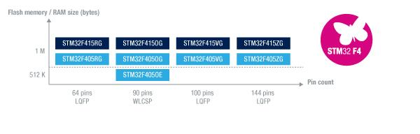
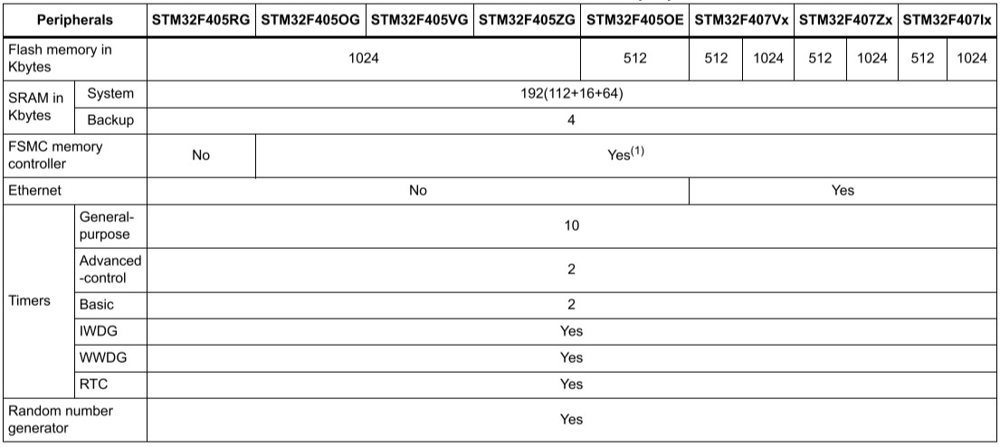

# [STM32F405](https://github.com/sochub/STM32F405) 
 
#### 父级：[STM32F4](https://github.com/sochub/STM32F4)
#### 架构：[Cortex M4](https://github.com/sochub/CM4) 
#### 收录芯片定级：[Level](https://github.com/sochub/Level)
### [芯片简介](https://github.com/sochub/STM32F405/wiki)

STM32F405提供了工作频率为168 MHz的Cortex™-M4内核（具有浮点单元）的性能。向需要10 x 10 mm的封装内实现高集成度、高性能、嵌入式存储器和外设的医疗、工业与消费类应用。

在168 MHz频率下，从Flash存储器执行时，STM32F405能够提供210 DMIPS/566 CoreMark性能，并且利用意法半导体的ART加速器实现了FLASH零等待状态。DSP指令和浮点单元扩大了产品的应用范围。

 

### 关键特性

 

* SDIO interface是STM32F4系列才配备的

### [收录资源](https://github.com/sochub/STM32F405)

* [参考文档](docs/)
* [参考资源](src/)

### [关联资源](https://github.com/sochub)

* [编译工具](https://github.com/sochub/arm-none-eabi)

### [选型建议](https://github.com/sochub)

[STM32F405](https://github.com/sochub/STM32F405)和[STM32F407](https://github.com/sochub/STM32F407) 在一定程度上差异不大，单独出来可以作为后者的低配选择，包括更低的GPIO，可以保证在外设足够的情况下降低成本。

* 向下替换方案 [STM32F105](https://github.com/sochub/STM32F105) 
* 相近替换方案 [STM32F407](https://github.com/sochub/STM32F429) 

##  [SoC资源平台](http://www.qitas.cn)
